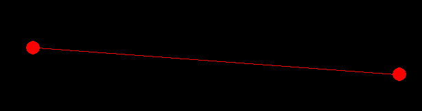

# Лабораторная работа 4 :red_circle:

## Краткое инфо

Дано `n` точек на плоскости. Построить выпуклый многоугольник, который включает все точки. Для решения этой задачи был выбран алгоритм `gift wrapping algorithm`. Его описание можно найти по этой [ссылке](https://en.wikipedia.org/wiki/Gift_wrapping_algorithm). Если крако обьяснять работу этого алгоритма, то  можно представить как происходит обтягивание верёвкой множества вбитых в доску гвоздей, начиная с нижнего самого левого гвоздя.

## Зависимости

-`pygame==1.9.6`

-`PIL`

## Как запустить программу

to run `python3 main.py --animate (1 or 0) --n N --path /path/to/textfile/`

`path` - путь к файлу с точками, который заданы посторчно в формате `x,y` (см.пример, файл `points.txt`)

Если оставить `path` пустым, то программа самостоятельно сгенерирует `n` случайных точек (по умолчанию 50)

Ещё точки можно сгенерировать с помощью скрипта предварительно задавая параметры в файле `cfg.ini` или используя параметры по умолчанию, точки сохраняются в файле
`point.txt` в нужном формате.

`animation` 1 - показывает анимацию, а 0 просто соединяет все точки сразу, показывая результат работы алгоритма

`n` - количество точек (если не передаётся файл в `path`). Имеет приоритет вышем `--path` с точки зрения указания точек. Если оставить `--path` пустым но в `--n` передать какое-то чило точек, то именно на этом мноэестве точек будет построен многоугольник. 

**P.S:** При ошибке `no module named pygame` --> `pip install pygame` или (если показывается ошибка) `sudo apt-get install python3-pygame`

## Примеры работы

Для 10 точек:

Для 2 точек: 

Для одной точки:

Для 0 точек будет вывелен черное окно которое закроется
